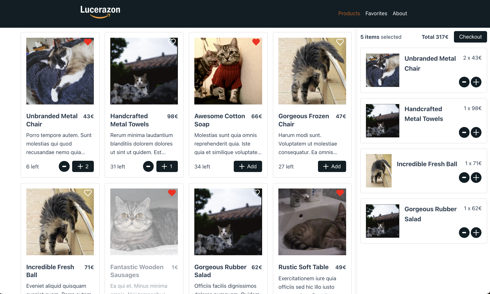

# Mini Vue Ecommerce

Welcome to the Mini Vue Ecommerce project! 🤗 a simulated mini e-commerce website made with Vue.js. Check the deployed version [on Render](https://mini-vue-ecommerce.onrender.com/).

This application is built with:

- [Vue 3](https://vuejs.org/) with [Router](https://router.vuejs.org/), [Pinia](https://pinia.vuejs.org/) and [TypeScript](https://www.typescriptlang.org/).
- [SASS](https://sass-lang.com/) for the styling.
- [Vite](https://vitejs.dev/) for the build and development tool.
- [JSON server](https://github.com/typicode/json-server) for the fake REST API.
- [Vitest](https://vitest.dev/) for unit testing.
- [ESLint](https://eslint.org/) and [Prettier](https://prettier.io/) for linting and formatting.



## Project Setup

```sh
npm install
npm run copy:db # copy data to db.json
```

### Development

Start JSON server and Vite for development.

```sh
npm run dev
```

### Run unit tests with [Vitest](https://vitest.dev/)

```sh
npm run test:unit
```

### Lint with [ESLint](https://eslint.org/)

```sh
npm run lint
```

### Format with [Prettier](https://prettier.io/)

```sh
npm run format
```

### Type-Check, Compile and Minify for Production

```sh
npm run build
```
